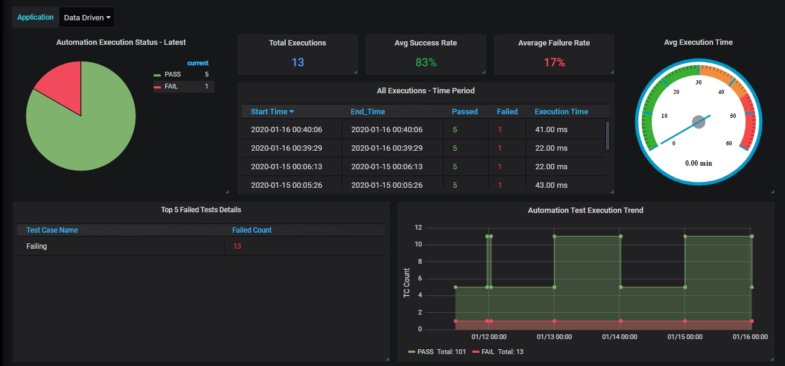

# Projeto de Testes Automatizados com Playwright

Este projeto utiliza o Playwright para realizar testes automatizados em aplicações web, integrando o monitoramento dos resultados com o Grafana e armazenamento em um banco de dados PostgreSQL. A seguir, estão os detalhes do projeto e como ele foi estruturado.

## Visão Geral

O objetivo principal deste projeto é automatizar testes de aplicações web utilizando o Playwright, reaproveitando o estado de autenticação (storage state) para otimizar a execução dos testes e garantir a eficiência. Os resultados dos testes são armazenados em um banco de dados PostgreSQL e monitorados via Grafana, permitindo fácil visualização e controle do status das execuções.

## Tecnologias Utilizadas

- **Playwright**: Utilizado para automação e testes.
- **Node.js**: Ambiente de execução para o Playwright.
- **PostgreSQL**: Banco de dados para armazenar os resultados dos testes.
- **Grafana**: Ferramenta de monitoramento para acompanhar os resultados dos testes.
- **Container Node.js**: Execução do ambiente de testes dentro de um container.

## Estrutura dos Testes

Os testes são organizados da seguinte forma:

1. **Autenticação com Storage State**: O Playwright permite reaproveitar o estado de autenticação (storage state), evitando que seja necessário realizar login antes de cada teste.
   - O primeiro teste executa o login e salva o estado de autenticação.
   - Nos testes subsequentes, esse estado salvo é reutilizado, o que elimina a necessidade de novas autenticações.

2. **Exemplo de Sites Testados**:
   - **Playwright.dev**: Site oficial do Playwright, usado como exemplo de teste.
   - **Swag Labs**: Usado para coletar o estado de autenticação antes da execução dos testes subsequentes.

## Monitoramento e Integração com o Grafana

O Playwright pode ser integrado ao Grafana para permitir o monitoramento contínuo dos resultados dos testes. Após a execução, os resultados são enviados para um banco de dados PostgreSQL, e o Grafana exibe esses resultados através de dashboards configuráveis.

- Exemplo usando o Grafana para mostrar as informações dos testes:



### Como Funciona

- Os testes são executados dentro de um container Node.js.
- O Playwright coleta informações sobre os testes.
- Os resultados dos testes (incluindo status de sucesso ou falha) são armazenados no banco de dados PostgreSQL.
- O Grafana é configurado para monitorar o banco de dados e exibir os resultados em tempo real.

## Requisitos

- **Docker**: Para rodar o ambiente em containers.
- **Node.js**: Para execução dos testes Playwright.
- **PostgreSQL**: Banco de dados para armazenar os resultados.
- **Grafana**: Para monitoramento dos resultados.

## Configuração do Projeto

1. Clone o repositório:
   ```bash
   git clone https://github.com/Paulo-Fabiano/System-Monitor
   ```

2. Configure o ambiente com o Docker

## Estrutura do Projeto

```bash
├── .auth/                       # Diretório de autenticação
├── Resultados-Testes/           # Diretório que armazena os resultados dos testes
├── testes/                      # Diretório de testes automatizados
│   ├── example.spec.js          # Teste de exemplo
│   ├── loginGlobal.setup.js     # Configuração de login global
├── customReporter.js            # Reporter personalizado para os testes
├── database.js                  # Script para interação com o banco de dados PostgreSQL
├── docker-compose.yaml          # Arquivo de configuração do Docker Compose
├── Dockerfile                   # Arquivo Docker para containerizar o ambiente de testes
├── Dockerfile.db                # Dockerfile para o banco de dados
├── init.sql                     # Script de inicialização do banco de dados
├── package-lock.json            # Arquivo de lock do NPM
├── package.json                 # Definições do projeto Node.js e dependências
├── playwright.config.js         # Configurações do Playwright
└── README.md                    # Documentação do projeto
└── imagens                      # Imagem do Dashboard do Grafana
```
## Funcionalidades Adicionais

1. Possibilidade de Criptografia do Estado de Autenticação (storage state).

2. Testes para Monitoramento de Rotas de APIs.

O Playwright é uma ferramenta extremamente completa e versátil para automação de testes em aplicações web. Além de permitir a criação de testes para interfaces gráficas interativas, ele oferece a capacidade de simular diferentes dispositivos e condições de rede, realizar testes em múltiplos navegadores simultaneamente e lidar com automação de tarefas complexas no front-end.

## Considerações Finais

Este projeto visa simplificar a execução de testes automatizados com Playwright e oferecer uma solução robusta para o monitoramento de resultados em tempo real. A utilização do storage state para autenticação economiza tempo durante os testes, e a integração com o Grafana permite um acompanhamento eficiente do desempenho da aplicação.

## toDo

O projeto está 80% concluído, o script faz os testes e a inserção das informações no banco de dados. Necessário apenas configurar os arquivos Docker.

- Configurar os arquivos ``` docker-compose.yalm``` e ```init.sql``` para automatizar a criação do container do PostgresSQL com a tabela e o usuário que o sistema irá utilizar para a inserção dos dados.